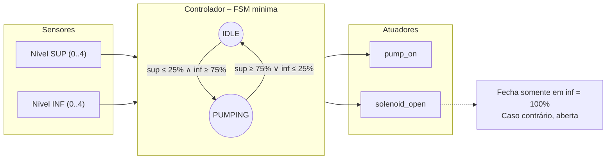

# Medição de Nível de Líquido — Versão Simplificada (FSM mínima · Verilog)

Controlador digital baseado em **FSM mínima (2 estados: `IDLE` e `PUMPING`)** para bombeamento entre dois tanques (inferior/superior), com sensores discretos de nível (0, 25, 50, 75, 100%).  
**Escopo:** sem estados de falha, sem debounce, sem temporizações, sem modo manual. Foco didático e funcional.

## 1) Visão Geral

- **Tanques:** inferior (fonte) e superior (destino)  
- **Sensores discretos:** 0/25/50/75/100% (codificados 0–4)  
- **Atores:** bomba (transfere do inferior → superior), válvula (alimenta o inferior)  
- **Displays 7 seg.:** exibem o nível de cada tanque (mapa 0–4)  
- **LEDs:** verde = bomba ligada; vermelho = válvula aberta

### Regras de Controle (FSM mínima)
- **Ligar bomba** quando: `sup ≤ 25%` **e** `inf ≥ 75%`
- **Desligar bomba** quando: `sup ≥ 75%` **ou** `inf ≤ 25%`
- **Válvula:** inicia **ABERTA**; **fecha apenas** em `inf = 100%`; reabre se `inf < 100%`

> **Importante:** Sem falhas, debounce, timeouts, UART, logs, nem modo manual nesta versão.

## 2) Entradas, Saídas e Parâmetros

### Entradas
- `clk` — clock  
- `rst_n` — reset **síncrono**, ativo em nível baixo  
- `lvl_inf[2:0]` — nível do tanque inferior (0 a 4)  
- `lvl_sup[2:0]` — nível do tanque superior (0 a 4)

### Parâmetros
- `INVERT_LEVEL_CODE` (default `0`) — se sensores físicos forem ativos em 0, use `1` para inverter a leitura internamente.

### Saídas
- `pump_on` — comando do relé da bomba (1 = ligada)  
- `solenoid_open` — comando da válvula (1 = aberta)  
- `led_green` — espelha estado da bomba (1 = ligada)  
- `led_red` — espelha estado da válvula (1 = aberta)  
- `seg_inf[6:0]`, `seg_sup[6:0]` — displays 7 seg. para níveis (0–4)

### Mapeamento de displays (sugestão)
- `0%→0`, `25%→1`, `50%→2`, `75%→3`, `100%→4` (use um decodificador 7-seg simples 0–4)

## 3) FSM mínima

Estados:  
- `IDLE` — bomba desligada; aguarda condição de partida  
- `PUMPING` — bomba ligada; permanece até condição de parada

Transições (com histerese nos limiares 25/75%):
- `IDLE → PUMPING` se `sup ≤ 25%` **e** `inf ≥ 75%`
- `PUMPING → IDLE` se `sup ≥ 75%` **ou** `inf ≤ 25%`

Ações:
- Em `PUMPING`: `pump_on = 1`  
- `solenoid_open = 1`, exceto **fecha** se `inf = 100%`

## 4) Estrutura de Pastas (sugerida)

```
.
├─ src/
│  ├─ pump_controller.v
│  └─ sevenseg_decoder.v        # opcional (0–4)
├─ sim/
│  └─ tb_pump_controller.v
├─ docs/
│  ├─ fsm_diagram.mmd
│  └─ state_table.md
└─ README.md
```

## 5) Como Simular (Icarus Verilog + GTKWave)

> Pré-requisitos: **Icarus Verilog** (`iverilog`, `vvp`) e **GTKWave**.

```bash
# 1) Compilar
iverilog -g2012 -o sim/out.vvp sim/tb_pump_controller.v src/pump_controller.v src/sevenseg_decoder.v

# 2) Executar
vvp sim/out.vvp

# 3) Abrir waveform (se o TB gerar dump .vcd)
gtkwave sim/waves.vcd &
```

- O testbench gera logs com `$display` e inclui checagens (`$fatal`) para cada cenário.
- Ajuste caminhos conforme sua máquina.

## 6) Critérios de Verificação (Testbench mínimo)

Cenários obrigatórios:
1. **Partida normal:** quando `sup ≤ 25%` **e** `inf ≥ 75%` → `pump_on` deve ir `1`.  
2. **Desligamento por sup alto:** quando `sup ≥ 75%` → `pump_on` deve ir `0`.  
3. **Desligamento por inf baixo:** quando `inf ≤ 25%` → `pump_on` deve ir `0`.

Boas práticas:
- Gerar `clk` e aplicar `rst_n` inicial
- Usar `$display` para marcos de verificação
- Usar `assert`/`$fatal` (SV) ou checagens condicionais simples (Verilog)

## 7) Tabelas e Diagramas

- **`docs/state_table.md`**: tabela de transição (estado atual, condição, próximo estado, ações).  
- **`docs/fsm_diagram.mmd`**: diagrama Mermaid com `IDLE` ↔ `PUMPING`.

## 8) Limitações (por desenho)

- Sem falhas, debounce, temporizações, modo manual ou códigos de erro.  
- Para evoluções: adicionar debounce, estado de falha, modos auto/manual, temporizações e parametrizações.

## 9) Licença

MIT


## 📟 Interface (Entradas, Saídas e Parâmetros)

### Entradas

| Sinal | Largura | Descrição |
| :--- | :--- | :--- |
| `clk` | 1 bit | [cite_start]Clock global do sistema. |
| `rst_n` | 1 bit | [cite_start]Reset **síncrono**, ativo em nível baixo (0). |
| `lvl_inf_raw` | 3 bits | [cite_start]Nível "cru" do tanque inferior (valor de 0 a 4). |
| `lvl_sup_raw` | 3 bits | [cite_start]Nível "cru" do tanque superior (valor de 0 a 4). |

### Saídas

| Sinal | Largura | Descrição |
| :--- | :--- | :--- |
| `pump_on` | 1 bit | [cite_start]Comando da bomba (1 = Ligada). |
| `solenoid_open` | 1 bit | [cite_start]Comando da válvula (1 = Aberta). |
| `led_green` | 1 bit | Espelha `pump_on` (1 = Ligada). |
| `led_red` | 1 bit | Espelha `solenoid_open` (1 = Aberta). |
| `seg_inf` | 7 bits | [cite_start]Saída 7-seg para o nível do tanque inferior. |
| `seg_sup` | 7 bits | [cite_start]Saída 7-seg para o nível do tanque superior[cite:1]. |

### Parâmetros

| Parâmetro | Default | Descrição |
| :--- | :--- | :--- |
| `INVERT_LEVEL_CODE` | `0` | Se `1`, inverte a leitura dos sensores (ex: `4-lvl_raw`). [cite_start]Útil se os sensores físicos forem ativos em 0. |

---

## 📈 Máquina de Estados (FSM)

A FSM possui dois estados, `IDLE` e `PUMPING`, com transições baseadas na lógica de histerese (limiares de 25% e 75%) para evitar que a bomba ligue e desligue rapidamente.

### Diagrama da FSM



🧪 Critérios de Verificação (Testbench)
O testbench (tb_pump_controller.v) foi projetado para validar os cenários críticos de operação usando logs ($display) e verificações ($fatal).

- Cenários obrigatórios validados:
1) Reset: Garante que o sistema inicie no estado IDLE.
2) Partida Normal: Simula sup ≤ 25% e inf ≥ 75% e verifica se pump_on vai para 1.
3) Desligamento (Superior Alto): Com a bomba ligada, simula sup ≥ 75% e verifica se pump_on vai para 0.
4) Desligamento (Inferior Baixo): Religa a bomba e simula inf ≤ 25%, verificando se pump_on vai para 0.
5) Controle da Válvula: Verifica se solenoid_open vai para 0 quando inf = 100% e se reabre (1) quando inf < 100%.