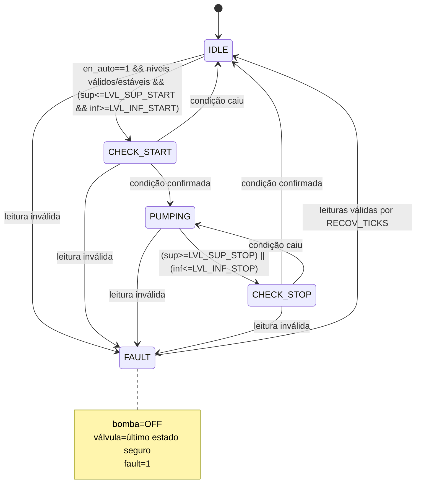

```mermaid
stateDiagram-v2
    [*] --> IDLE

    IDLE --> CHECK_START: en_auto==1 && níveis válidos/estáveis && (sup<=LVL_SUP_START && inf>=LVL_INF_START)
    CHECK_START --> PUMPING: condição confirmada
    CHECK_START --> IDLE: condição caiu

    PUMPING --> CHECK_STOP: (sup>=LVL_SUP_STOP) || (inf<=LVL_INF_STOP)
    CHECK_STOP --> IDLE: condição confirmada
    CHECK_STOP --> PUMPING: condição caiu

    state FAULT

    IDLE --> FAULT: leitura inválida
    CHECK_START --> FAULT: leitura inválida
    PUMPING --> FAULT: leitura inválida
    CHECK_STOP --> FAULT: leitura inválida

    FAULT --> IDLE: leituras válidas por RECOV_TICKS

    note right of FAULT
      bomba=OFF
      válvula=último estado seguro
      fault=1
    end note
```
