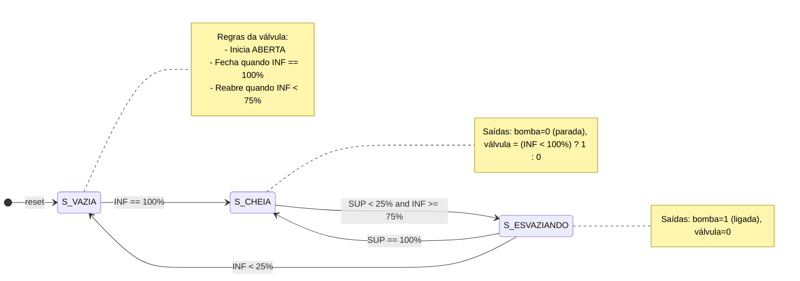

```mermaid
stateDiagram-v2
direction LR

[*] --> S_VAZIA : reset
S_VAZIA --> S_CHEIA : INF == 100%
S_CHEIA --> S_ESVAZIANDO : SUP < 25% and INF >= 75%
S_ESVAZIANDO --> S_CHEIA : SUP == 100%
S_ESVAZIANDO --> S_VAZIA : INF < 25%

note right of S_CHEIA
  Saídas: bomba=0 (parada), válvula = (INF < 100%) ? 1 : 0
end note

note right of S_ESVAZIANDO
  Saídas: bomba=1 (ligada), válvula=0
end note

note right of S_VAZIA
  Regras da válvula:
  - Inicia ABERTA
  - Fecha quando INF == 100%
  - Reabre quando INF < 75%
end note

```