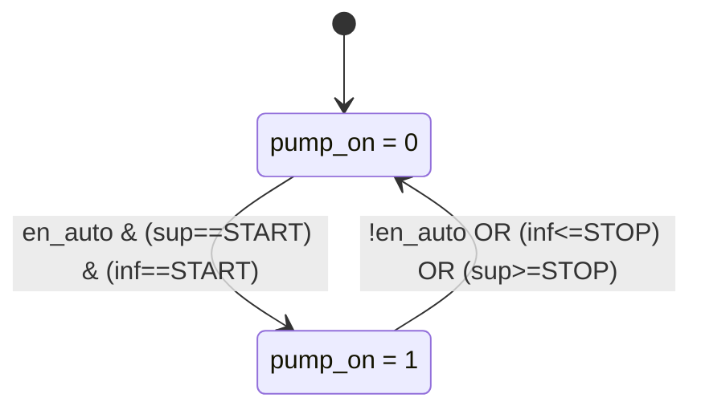

```mermaid

stateDiagram-v2
    [*] --> IDLE

    IDLE: pump_on = 0
    PUMPING: pump_on = 1

    IDLE --> PUMPING: en_auto & (sup==START) & (inf==START)
    PUMPING --> IDLE: !en_auto OR (inf<=STOP) OR (sup>=STOP)

```