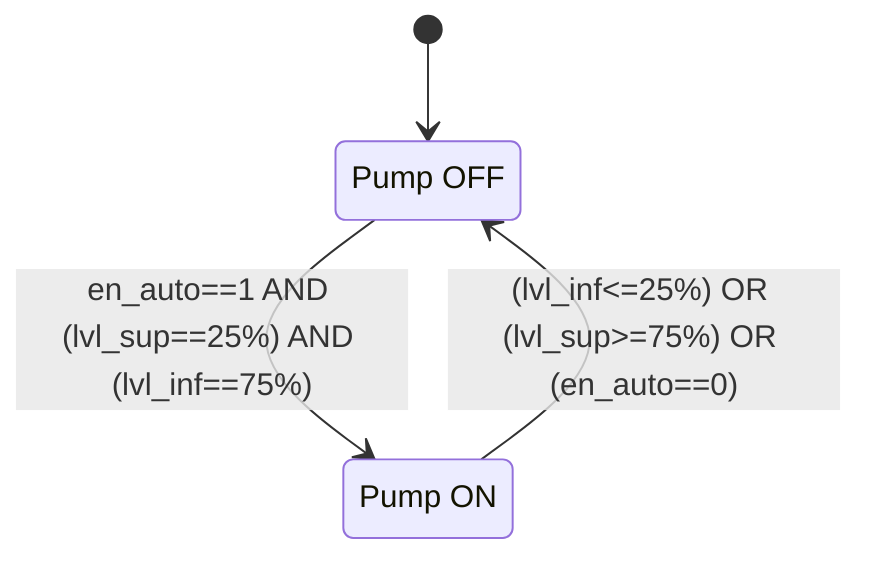

```mermaid

%% fsm_diagram_simple.mmd
%% Simplified two-state FSM (no debounce, no fault)
stateDiagram-v2
    [*] --> IDLE

    IDLE: Pump OFF
    PUMPING: Pump ON

    IDLE --> PUMPING: en_auto==1 AND (lvl_sup==25%) AND (lvl_inf==75%)
    PUMPING --> IDLE: (lvl_inf<=25%) OR (lvl_sup>=75%) OR (en_auto==0)

```
