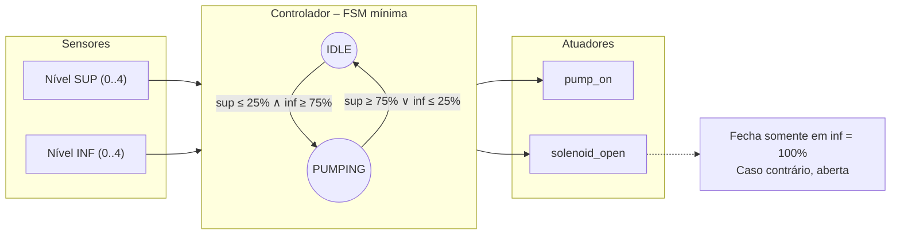

```mermaid

flowchart LR
  subgraph Sensores
    S_SUP["Nível SUP (0..4)"]
    S_INF["Nível INF (0..4)"]
  end

  S_SUP --> FSM
  S_INF --> FSM

  subgraph FSM[Controlador – FSM mínima]
    IDLE((IDLE))
    PUMP((PUMPING))
    IDLE -- "sup ≤ 25% ∧ inf ≥ 75%" --> PUMP
    PUMP -- "sup ≥ 75% ∨ inf ≤ 25%" --> IDLE
  end

  subgraph Atuadores
    PUMPON["pump_on"]
    VALV["solenoid_open"]
  end

  FSM --> PUMPON
  FSM --> VALV

  NOTE["Fecha somente em inf = 100%<br/>Caso contrário, aberta"]
  VALV -.-> NOTE

```
