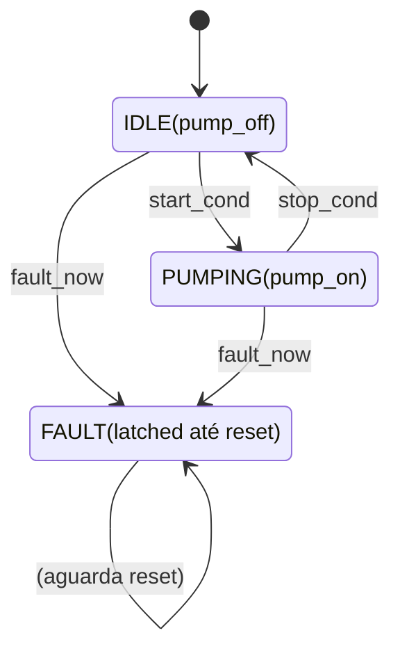

```mermaid
%% fsm_diagram_robust.mmd
%% FSM com robustez: sincronização + debounce + FAULT latched
stateDiagram-v2
    [*] --> IDLE

    state "IDLE(pump_off)" as IDLE
    state "PUMPING(pump_on)" as PUMPING
    state "FAULT(latched até reset)" as FAULT

    %% Condições (entradas após debounce):
    %% start_cond := en_auto==1 && (lvl_sup==25%) && (lvl_inf==75%)
    %% stop_cond  := (lvl_inf<=25%) || (lvl_sup>=75%) || (en_auto==0)
    %% fault_now  := invalid_code || jump>MAX_STEP || overflow_sup || dry_inf

    IDLE --> PUMPING: start_cond
    IDLE --> FAULT: fault_now
    PUMPING --> IDLE: stop_cond
    PUMPING --> FAULT: fault_now
    FAULT --> FAULT: (aguarda reset)

```
